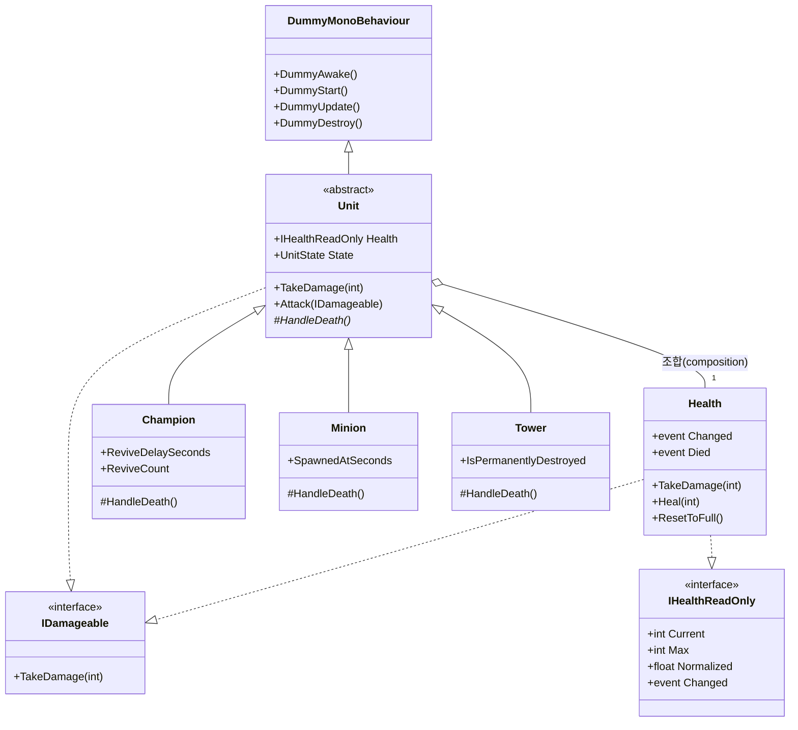
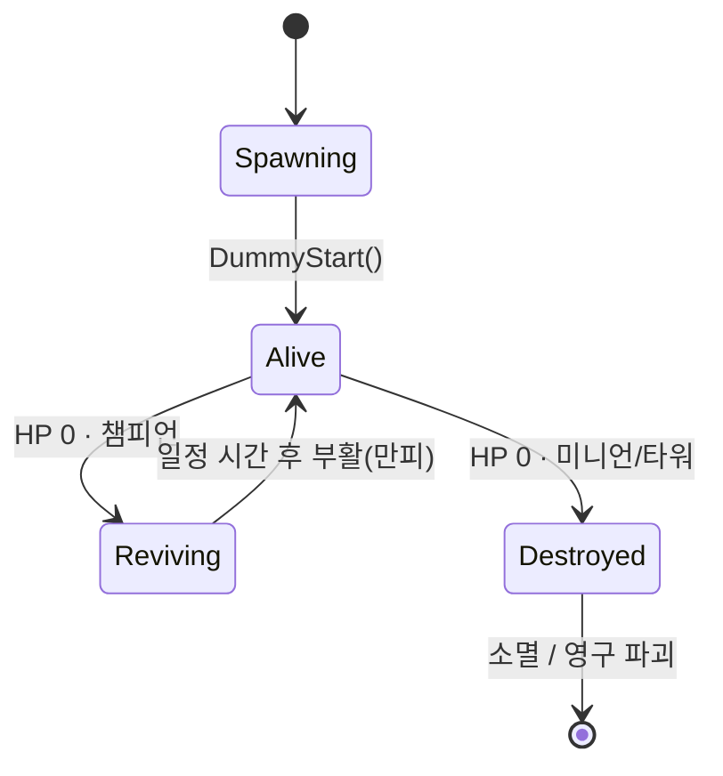
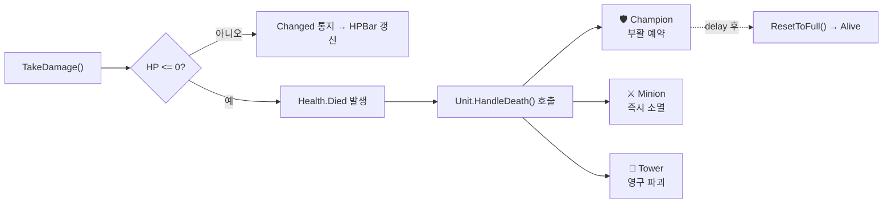
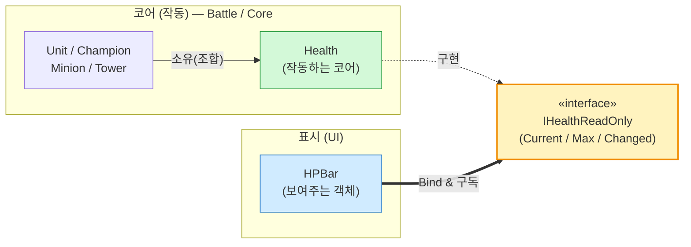
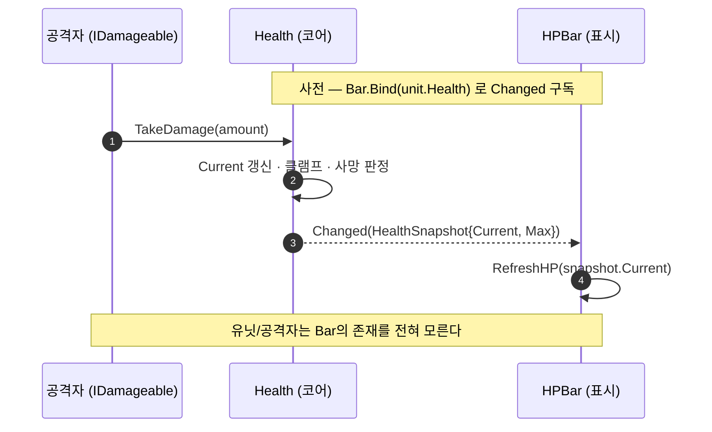

# MTM — 인게임 유닛 설계 (Champion / Minion / Tower)

> **파빌라(Favilla) 사전과제** · MTM 프로젝트 인게임 유닛 설계 테스트
> 챔피언 · 미니언 · 타워의 **사망 정책 분기**와, 유닛 ↔ HPBar **완전 디커플링** 설계.

<p>
  
  
  
  
  
  <a href="https://github.com/MelonS/mtm-unit-design/actions/workflows/ci.yml"></a>
</p>

---

## 📌 한눈에 보기 (TL;DR)

이 과제의 본질은 **"설계 능력"** 확인입니다. 그래서 두 가지를 모두 준비했습니다.

| | 내용 |
|---|---|
| 🎯 **핵심 설계** | `Champion` / `Minion` / `Tower` 유닛 + **유닛↔HPBar 의존성 0** 구조 |
| ➕ **기대 이상(+@)** | 설계가 **실제로 동작함을 증명**하는 ① 콘솔 전투 시뮬레이션 ② 22개 자동화 테스트 ③ CI |

세 가지 핵심 설계 결정:

1. **HP는 상속이 아니라 `조합(composition)`** — `Unit`은 `Health` 코어를 *가진다*. → HP의 책임을 유닛 본체에서 떼어냄.
2. **사망 행동은 `Template Method`로 분기** — `Unit.HandleDeath()`를 챔피언/미니언/타워가 각자 구현. 부활/소멸/영구파괴.
3. **HPBar는 `Observer + 의존성 역전(DIP)`** — 유닛은 자신을 누가 그리는지 모르고, HPBar는 유닛 타입을 모른다. 둘 다 **추상(`IHealthReadOnly`)에만** 의존.

> 과제는 "컴파일 안 돼도 OK"라고 했지만, 본 제출물은 **빌드·실행·테스트가 전부 통과**합니다. (`dotnet test` → 22/22 ✅)

---

## ✅ 요구사항 ↔ 구현 매핑

| 과제 요구사항 | 구현 | 위치 |
|---|---|---|
| **(1)** 챔피언: 죽으면 일정 시간 후 **부활** | `BattleManager.Schedule(delay, Revive)` 예약 후 만피 복귀 | [`Champion.cs`](src/MTM.Units/Battle/Champion.cs) |
| **(1)** 미니언: 죽으면 **소멸** | `HandleDeath()` → `DummyDestroy()`, 재등록 없음 | [`Minion.cs`](src/MTM.Units/Battle/Minion.cs) |
| **(1)** 미니언: 생성 시 `CurrentGameSeconds`에 **비례한 공격력** | 생성자에서 게임시간 캡처 → 공격력 확정 | [`Minion.cs`](src/MTM.Units/Battle/Minion.cs) |
| **(1)** 타워: 죽으면 **영구 파괴** | `IsPermanentlyDestroyed = true`, 부활 경로 차단 | [`Tower.cs`](src/MTM.Units/Battle/Tower.cs) |
| **(2)** 유닛→HPBar **의존성 없이** HPBar가 임의 대상 HP 반영 | `HPBar.Bind(IHealthReadOnly)` — 관찰자 패턴 | [`HPBar.cs`](src/MTM.Units/UI/HPBar.cs), [`Health.cs`](src/MTM.Units/Core/Health.cs) |
| **(2)** '보여주는' 객체 ↔ '작동하는 코어' 책임 분리 | `HPBar`(표시) ↔ `Health`(코어), 추상으로만 연결 | [`IHealth.cs`](src/MTM.Units/Core/IHealth.cs) |

---

## 🚀 빠른 시작

```bash
# 1) 클론
git clone https://github.com/MelonS/mtm-unit-design.git
cd mtm-unit-design

# 2) 전투 시뮬레이션 실행 (설계가 실제로 도는 모습)
dotnet run -c Release --project src/MTM.Simulation

# 3) 자동화 테스트 (요구사항 + 구조적 디커플링 검증)
dotnet test
```

> 요구 환경: **.NET SDK 3.1+** (코어 라이브러리는 `netstandard2.1` → Unity 2021+ 에 그대로 드롭인 가능)

---

## 🗂️ 프로젝트 구조

```
mtm-unit-design/
├─ src/
│  ├─ MTM.Units/                  # ⭐ 핵심 설계 라이브러리 (netstandard2.1)
│  │  ├─ Core/
│  │  │  ├─ DummyMonoBehaviour.cs # (제공) Unity 라이프사이클 더미
│  │  │  ├─ IHealth.cs            # IHealthReadOnly / IDamageable / HealthSnapshot
│  │  │  └─ Health.cs             # '작동하는 코어' — 값 규칙 + 변경 통지
│  │  ├─ Battle/
│  │  │  ├─ BattleManager.cs      # (제공+확장) 게임시간 + 부활 스케줄러
│  │  │  ├─ Unit.cs               # 추상 기반 (조합으로 Health 보유)
│  │  │  ├─ Champion.cs           # 사망 → 부활
│  │  │  ├─ Minion.cs             # 사망 → 소멸, 시간비례 공격력
│  │  │  └─ Tower.cs              # 사망 → 영구 파괴
│  │  └─ UI/
│  │     └─ HPBar.cs              # (제공+확장) 표시 전용, 추상에만 의존
│  └─ MTM.Simulation/             # ➕ 콘솔 전투 시뮬레이션 (검증용)
├─ tests/
│  └─ MTM.Units.Tests/            # ➕ xUnit 22개 (행동 + 구조 검증)
├─ docs/
│  └─ sample-run.txt              # 시뮬레이션 전체 트랜스크립트
└─ TODO/                          # 과제 원본 제공 파일
```

---

## 🧩 핵심 설계 1 — 유닛 클래스 계층

`Unit`은 `DummyMonoBehaviour`(Unity 모사)를 상속하고, **HP는 상속이 아니라 `Health`를 조합**으로 가진다.
이 한 줄의 결정이 선택 과제(HPBar 디커플링)까지 자연스럽게 풀어준다.



### 유닛 생명주기 상태도



---

## 💀 핵심 설계 2 — 사망 정책 분기 (Template Method)

코어(`Health`)가 HP 0을 감지해 `Died` 이벤트를 쏘면, `Unit`이 받아 **`HandleDeath()` 훅**을 호출한다.
"어떻게 죽는가"의 차이만 하위 타입이 구현하므로, 공통 사망 흐름은 한 곳에 모인다.

| 유닛 | 사망 시 행동 | `HandleDeath()` 구현 | 최종 상태 |
|---|---|---|---|
| 🛡️ **Champion** | 일정 시간 후 부활 | `BattleManager.Schedule(delay, Revive)` | `Reviving` → `Alive` |
| ⚔️ **Minion** | 즉시 소멸 (부활 없음) | `DummyDestroy()` | `Destroyed` |
| 🏰 **Tower** | 영구 파괴 | `IsPermanentlyDestroyed = true; DummyDestroy()` | `Destroyed` (영구) |



### 미니언 — 생성 시간 비례 공격력

미니언은 **생성 시점의 `BattleManager.CurrentGameSeconds`를 캡처**해 공격력을 *확정*한다(이후 시간이 흘러도 고정).
후반 웨이브일수록 강해지는 라인 미니언 스케일링을 표현한다.

```csharp
// Minion.cs — "생성시 공격력 세팅"
SpawnedAtSeconds = BattleManager.CurrentGameSeconds;
_attackDamage    = GetProperAttackDamageBy(SpawnedAtSeconds);

private int GetProperAttackDamageBy(int gameSeconds) => 10 + gameSeconds / 2;
```

| 생성 시간(초) | 0 | 8 | 16 | 24 | 32 |
|---|---|---|---|---|---|
| 공격력 | **10** | **14** | **18** | **22** | **26** |

---

## 🎯 핵심 설계 3 — 유닛 ↔ HPBar 완전 디커플링 (선택 과제)

> **요구사항**: 유닛 클래스 → HPBar 의존성이 **없는** 채로, HPBar가 **임의 대상**의 최신 HP를 반영. '보여주는' 객체와 '작동하는 코어'의 책임 분리.

### 해법: 관찰자(Observer) + 의존성 역전(DIP)

의존의 화살표가 **모두 가운데 추상(`IHealthReadOnly`)을 향한다.** 유닛과 HPBar는 서로를 **컴파일 시점에 전혀 모른다.**



- **유닛은 HPBar를 모른다** — 코드 어디에도 `using UI;` 가 없다.
- **HPBar는 유닛을 모른다** — `Bind(IHealthReadOnly)` 인자는 추상뿐. (구조 테스트로 강제 검증 ✅)
- **연결의 책임은 제3자**(소유자/프리젠터)가 진다: `hpBar.Bind(unit.Health)` 한 줄.

### HP 갱신 흐름 (시퀀스)



### 왜 이렇게 좋은가

| 관심사 | 누가 책임지나 | 모르는 것 |
|---|---|---|
| HP 값/규칙/사망 (**작동**) | `Health` | UI가 몇 개 붙는지, 누가 그리는지 |
| HP 시각화 (**표시**) | `HPBar` | 대상이 챔피언인지 타워인지 |
| 둘의 연결 | 소유자(`Bind` 호출) | — |

- **임의 대상 지원**: `IHealthReadOnly`만 구현하면 무엇이든 표시 가능 — 유닛이 아닌 파괴 가능 오브젝트/거점에도 그대로 붙는다.
- **N:1 관찰**: 한 `Health`에 여러 `HPBar`(체력바 + 미니맵 + 보스 UI)를 동시에 붙여도 됨.
- **누수 방지**: `Bind`는 이전 구독을 해제하고, `Unbind()`/`DummyDestroy()`로 자동 해제 → 유령 갱신/메모리 누수 차단.

---

## 🧠 설계 의사결정 & 트레이드오프

<details open>
<summary><b>1. HP를 왜 상속이 아니라 조합(Health)으로 뒀나</b></summary>

> "유닛이 HP를 *가진다*"가 "유닛이 HP*이다*"보다 정확하다. HP를 별도 객체로 분리하니 **표시 책임(HPBar)을 유닛에서 깔끔히 떼어낼 수 있었고**, HP 규칙(클램프/사망/회복)을 한 곳에서 테스트할 수 있다. 선택 과제가 자연스럽게 풀린 근본 원인.
</details>

<details>
<summary><b>2. 사망 정책 — Template Method vs Strategy</b></summary>

> 명세상 "어떻게 죽는가"는 **유닛의 정체성**과 1:1로 묶인다(챔피언=항상 부활, 타워=항상 영구파괴). 그래서 런타임 교체가 필요 없는 지금은 **Template Method**(`HandleDeath` override)가 더 읽기 쉽고 응집도가 높다. 만약 "부활 불가 디버프" 같이 **사망 행동이 런타임에 바뀌어야** 한다면, `Unit`에 `IDeathPolicy`를 주입하는 **Strategy**로 무리 없이 승격된다(공통 사망 흐름은 그대로 재사용).
</details>

<details>
<summary><b>3. HP 통지 — 이벤트(push) vs 폴링(pull)</b></summary>

> 매 프레임 `Update`에서 HP를 폴링하면 변화가 없어도 비용이 들고, 변화 순간을 놓친다. **변경 시에만 스냅샷을 push**하는 이벤트 방식이 효율적이고, "최신 상태 반영"이라는 요구에 정확히 맞는다. 값이 실제로 바뀔 때만 통지(불필요한 발화 억제)한다.
</details>

<details>
<summary><b>4. BattleManager는 왜 static인가</b></summary>

> 제공된 명세가 `BattleManager.CurrentGameSeconds` 정적 접근을 전제하므로 그 계약을 지켰다. 대신 `Tick`/`Schedule`/`Reset`을 더해 **테스트에서 게임시간을 제어**할 수 있게 했다. 운영 코드라면 `IGameClock` 주입(DI)으로 전환해 전역 상태를 없앴을 것이며, 테스트 병렬화도 켤 수 있다(현재는 정적 상태 보호를 위해 비활성).
</details>

<details>
<summary><b>5. 통지 페이로드로 왜 불변 struct(HealthSnapshot)를 쓰나</b></summary>

> 표시 객체에 `Health` 자체를 넘기면 UI가 코어를 *변경*할 수 있다. **읽기 전용 스냅샷 값**만 넘겨 표시↔코어의 단방향성을 코드로 강제한다.
</details>

---

## 🖥️ 실행 결과 — 전투 시뮬레이션

`dotnet run --project src/MTM.Simulation` 의 실제 출력입니다. (전체: [`docs/sample-run.txt`](docs/sample-run.txt))
**실 유닛 + 실 HPBar 바인딩**으로 도는 결정론적 라인 교전이며, 화면의 HP 막대는 **바인딩된 HPBar가 직접 구동**합니다.

```text
┌─ 초기 배치 (t=0s) ────────────────────────────────────────────────
│  [Blue]
│    Blue Outer Tower     [██████████████████████]  720/720  ATK  34  ALIVE
│    Garen (Blue)         [██████████████████████]  380/380  ATK  76  ALIVE
│    Minion#1 (Blue)      [██████████████████████]   70/70   ATK  10  ALIVE
│  [Red]
│    Red Outer Tower      [██████████████████████]  560/560  ATK  34  ALIVE
│    Riven (Red)          [██████████████████████]  300/300  ATK  76  ALIVE
└──────────────────────────────────────────────────────────────────
  t= 4s  [DEATH]   Riven (Red) 사망 → 5s 후 부활 예약 (예정 t=9s)
  t= 8s  [SPAWN]   미니언 웨이브 — ATK=14 (게임시간 8s 비례)
  t= 9s  [REVIVE]  Riven (Red) 부활! HP 만피 복귀 (총 1회)
  t=16s  [SPAWN]   미니언 웨이브 — ATK=18 (게임시간 16s 비례)
  t=18s  [DESTROY] Red Outer Tower 영구 파괴! (IsPermanentlyDestroyed=True)

╔══════════════════════════════════ 자기 검증 ══════════════════════════════╗
  ✅  챔피언: 죽으면 일정 시간 후 '부활'      └ Reviving→Alive 전이 관측됨
  ✅  미니언: 죽으면 '소멸'(영구)              └ Destroyed 전이 후 재등록 없음
  ✅  미니언: 생성 시간 비례 공격력 (10 → 18)  └ 후반 웨이브일수록 ATK 증가
  ✅  타워: 죽으면 '영구 파괴'                 └ IsPermanentlyDestroyed=true
  ✅  HPBar: 유닛 의존성 0으로 HP 실시간 반영  └ 매 틱 HPBar.CurrentHP == Health.Current
╚═══════════════════════════════════════════════════════════════════════════╝

  ✅ ALL REQUIREMENTS DEMONSTRATED — 설계가 의도대로 동작합니다.
```

---

## 🧪 테스트 — 요구사항 + 구조를 코드로 강제

```
$ dotnet test
통과한 테스트 수: 22   |   통과: 22   |   실패: 0
```

| 테스트 묶음 | 검증 내용 |
|---|---|
| `ChampionTests` | 사망→`Reviving`, 지연 전 부활 안 함, 지연 후 만피 부활, 반복 부활 |
| `MinionTests` | 사망→영구 소멸, 생성시간 비례 공격력, 공격력 생성시점 고정 |
| `TowerTests` | 사망→영구 파괴, 영구 유지, 파괴 후 추가 피해 무시 |
| `HealthBindingTests` | 초기/후속 HP 반영, 임의 타입 바인딩, 언바인드 누수 차단, 재바인딩, N:1 관찰, 파괴 시 자동 해제 |
| `ArchitectureTests` | **HPBar 표면에 Battle 타입 0 / 유닛 표면에 UI 타입 0** (리플렉션으로 디커플링 강제) |

> `ArchitectureTests`는 설계 의도를 문서가 아니라 **빌드가 깨지는 방식으로** 지킨다. 누군가 HPBar에 `Champion`을 끌어들이면 테스트가 실패한다.

---

## 🧱 확장성 — 새 요구가 와도 닫힌 채로 열린다 (OCP)

| 새 요구 | 바꾸는 곳 | 안 바꾸는 곳 |
|---|---|---|
| 새 유닛 타입(예: Inhibitor) | `Unit` 상속 + `HandleDeath()` 1개 | 코어/UI/전투 루프 |
| 사망 행동 런타임 교체 | `IDeathPolicy` 주입으로 승격 | 유닛 정체성/HP 코어 |
| HP를 미니맵·보스바에도 표시 | `HPBar` 하나 더 `Bind` | 유닛 코드 (무지) |
| 거점/파괴오브젝트 HP 표시 | `IHealthReadOnly` 구현 | HPBar (무지) |

---

## 📦 제출물 다운로드

> 과제 제출 방식: *"완성된 코드와 README를 하나의 압축 파일로 제출"*

- **📥 제출용 압축 파일(zip):** [최신 릴리스에서 다운로드](https://github.com/MelonS/mtm-unit-design/releases/latest)
  - 직접 링크: `https://github.com/MelonS/mtm-unit-design/releases/latest/download/mtm-unit-design-submission.zip`
- **🌐 공개 저장소:** https://github.com/MelonS/mtm-unit-design
- **📄 소스 아카이브:** [main.zip](https://github.com/MelonS/mtm-unit-design/archive/refs/heads/main.zip)

---

## 📎 부록

- **원본 제공 파일:** [`TODO/`](TODO/) — 과제 설명, `BattleManager.cs`, `DummyMonoBehaviour.cs`, `HPBar.cs`
- **진행 계획/체크리스트:** [`PLAN.md`](PLAN.md)
- **라이선스:** [MIT](LICENSE)
- **작성:** Eunhyung Choi ([@MelonS](https://github.com/MelonS))

<sub>설계 본질에 충실하되, "정말 도는가"를 시뮬레이션과 테스트로 끝까지 증명하는 데 초점을 맞췄습니다.</sub>
